# Airline Reservation System (Flask + MySQL)

> **Course Project – Intro to Databases (CS-UY 3083)**  
> **New York University Tandon School of Engineering**  
> Spring 2025 – Professor Ratan Dey

This project is a fully functional **web-based airline reservation system** developed using **Flask (Python)** and **MySQL** as part of the Intro to Databases course.  
It covers the **complete lifecycle** of a database-driven application — from ER modeling and relational schema design to backend implementation and deployment.

---

## 🎯 Objective
The goal of the project was to design, implement, and operate a **relational database** and build a web application that interacts with it for real-world use cases such as flight search, booking, ticket management, and airline staff operations.

---

## ✨ Features

### **Public (Unauthenticated)**
- Search for future flights (one-way / round-trip) by:
  - Source / Destination airport code
  - Source / Destination city
  - Departure / Return dates
- View flight status (on-time, delayed, cancelled)

### **Customer**
- Register / Login / Logout
- View upcoming and past flights
- Search flights with **dynamic pricing** (extra 20% when ≥60% seats booked)
- Purchase tickets with credit or debit cards
- Cancel flights (>24h before departure)
- Rate and comment on previous flights

### **Airline Staff**
- Register / Login / Logout
- View flights (filter by date range, source/destination)
- View customers for a flight
- Create new flights
- Update flight status (on-time / delayed / cancelled)
- Add airplanes and airports
- View flight ratings (average score + comments)
- View ticket sales reports (monthly/yearly with charts)

---

## 🛠 Tech Stack
- **Backend**: Python (Flask)
- **Database**: MySQL (PyMySQL connector)
- **Templating**: Jinja2 (Flask templates)
- **Frontend**: HTML, CSS (Bootstrap optional)
- **Environment**: Virtualenv / venv

---

## 📂 Project Structure
```
.
├── app.py                   # Main Flask application
├── requirements.txt         # Python dependencies
├── .env.example             # Sample environment variables
├── sql/                     # SQL scripts for database setup
│   └── create-tables.sql    # Contains CREATE TABLE statements
│   └── inserts.sql          # Contains INSERT statements for adding sample data
│   └── SQL_CREATE_TABLE_statements.pdf          
├── templates/               # HTML templates
│   ├── home.html
│   ├── login.html
│   ├── register.html
│   ├── customer_home.html
│   ├── staff_home.html
│   ├── search_for_flights.html
│   ├── buy_ticket.html
│   ├── view_my_flights.html
│   ├── previous_flights.html
│   ├── rate_comment.html
│   ├── view_flights.html
│   ├── flight_customer_list.html
│   ├── view_ratings.html
│   ├── create_flight.html
│   ├── add_airplane.html
│   ├── add_airport.html
│   └── view_reports.html
```

---

## 🚀 Getting Started

### 1️⃣ Install dependencies
```bash
pip install -r requirements.txt
```

### 2️⃣ Configure environment variables
Create `.env` from `.env.example` and update with your MySQL credentials:
```
FLASK_SECRET_KEY=change-me
MYSQL_HOST=localhost
MYSQL_USER=root
MYSQL_PASSWORD=
MYSQL_DB=air_ticket_reservation_system
```

### 3️⃣ Database Setup
This project uses a **local MySQL database** (via XAMPP + phpMyAdmin).  
To set it up:
1. Start Apache and MySQL in XAMPP.
2. Open [http://localhost/phpmyadmin](http://localhost/phpmyadmin).
3. Create a new database named `air_ticket_reservation_system`.
4. Import the `create_tables.sql` file from the `sql/` folder to create all required tables.
5. (Optional) Add sample data if provided.

*Note: The database is local to your computer — no external access is possible unless you explicitly configure it.*

### 4️⃣ Start the server
```bash
flask run
```
Visit [http://127.0.0.1:5000](http://127.0.0.1:5000)

---

## 🔐 Security Considerations
- Use **hashed passwords** (`generate_password_hash`) instead of MD5 for production.
- Store secrets in `.env` and never commit them.
- Validate all user inputs to prevent SQL injection & XSS.
- Restrict airline staff actions to authorized users only.

---

## 🧪 Use Cases & Routes

### **Customer**
- `/register` – Register as customer
- `/login` – Login
- `/customer_home` – Customer dashboard
- `/view_my_flights` – View purchased future flights
- `/previous_flights` – View past flights
- `/search_for_flights_logged_in` – Search & book
- `/purchase_ticket` – Buy a ticket
- `/cancel_flight` – Cancel upcoming flight
- `/rate_comment` – Rate & comment

### **Airline Staff**
- `/register` – Register as staff
- `/staff_home` – Staff dashboard
- `/view_flights` – View & filter flights
- `/create_flight` – Create new flight
- `/update_status` – Update flight status
- `/add_airplane` – Add airplane
- `/add_airport` – Add airport
- `/view_customers` – View customers for flight
- `/view_ratings` – See flight ratings
- `/view_reports` – Sales reports

---

## 📸 Screenshots

### Customer Pages
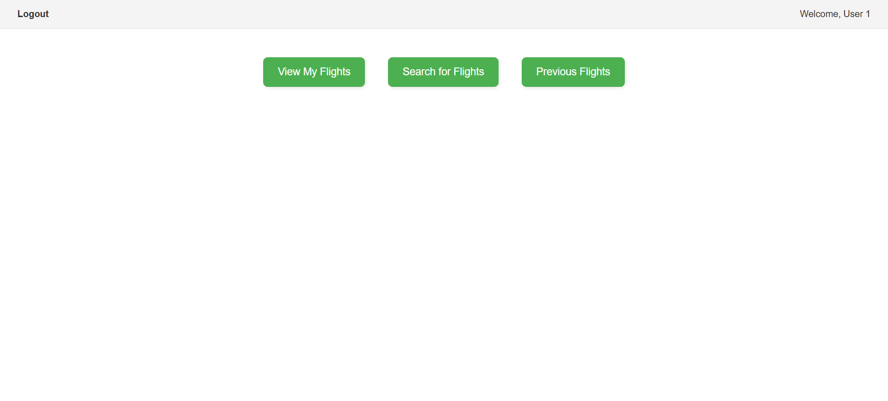  
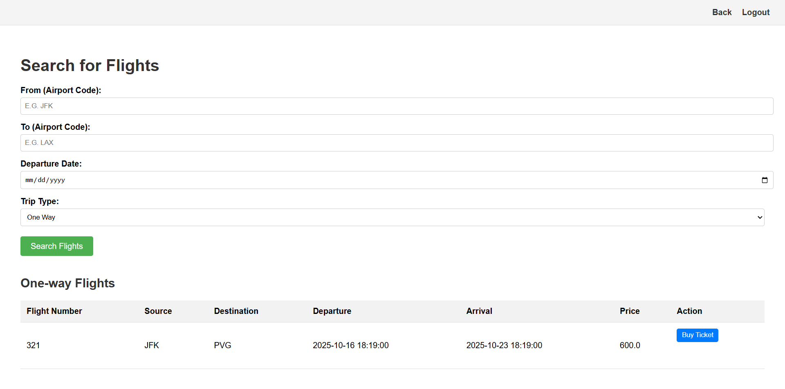  
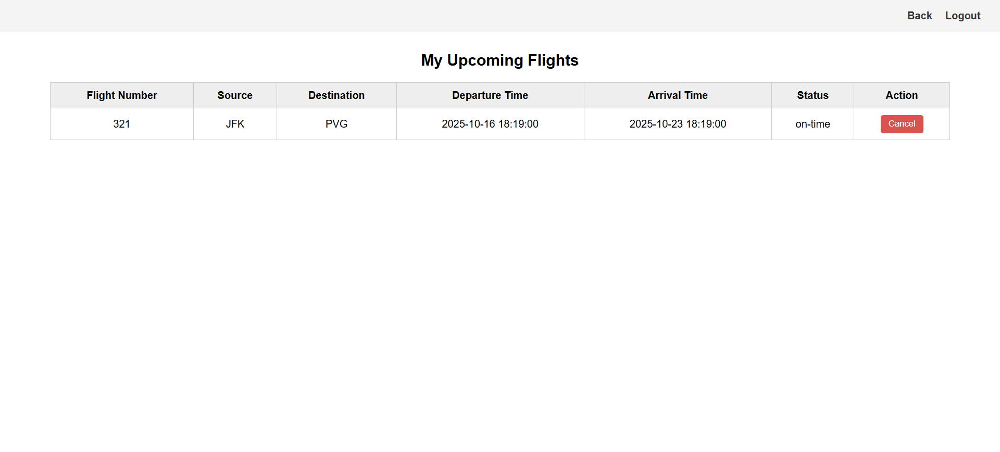  
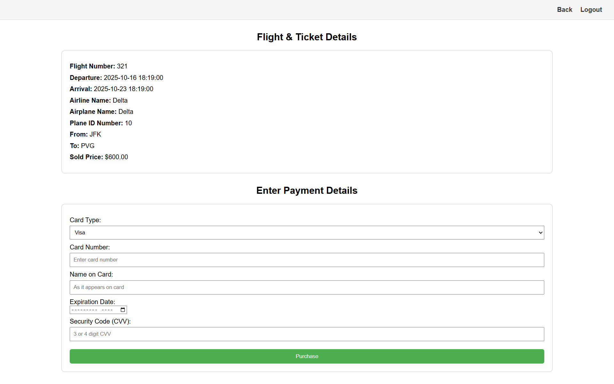  
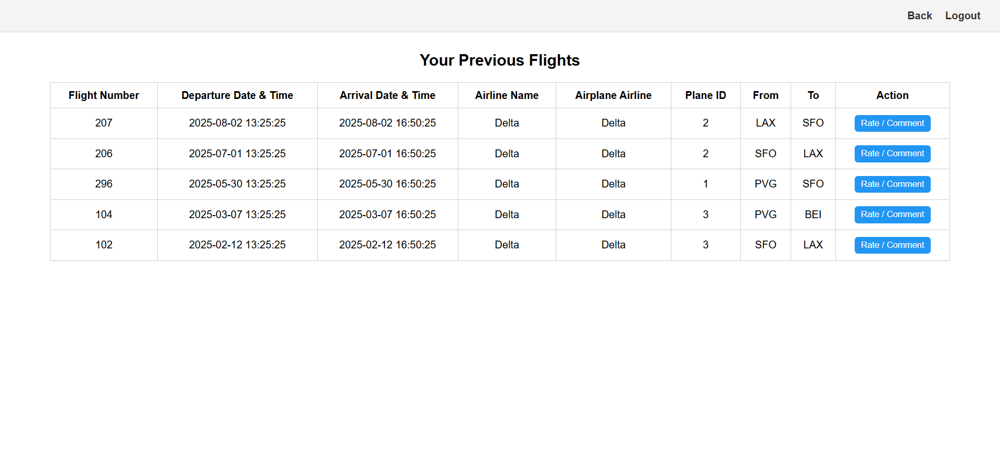  

### Public Pages
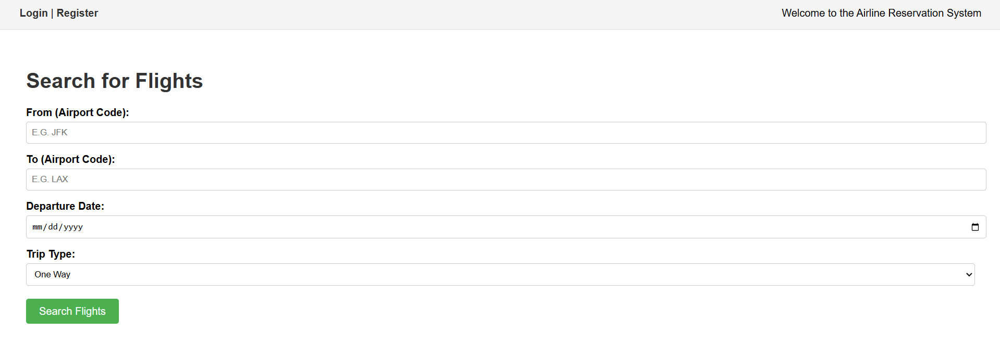  
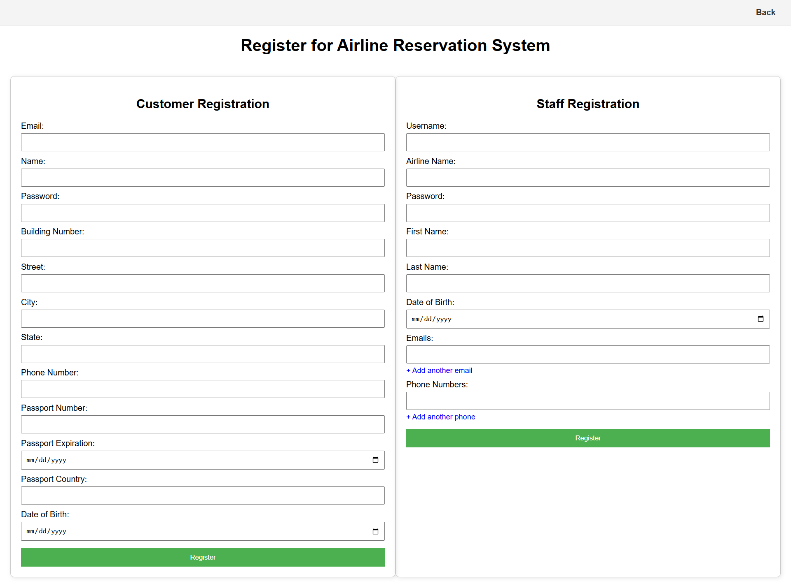  
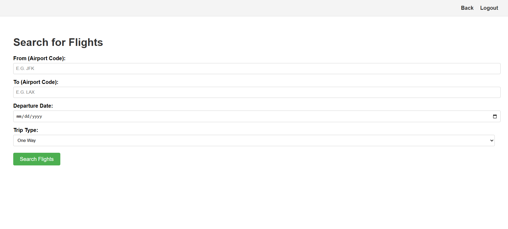  

### Airline Staff Pages
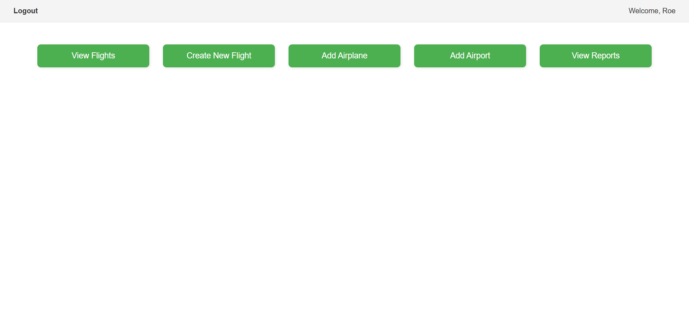  
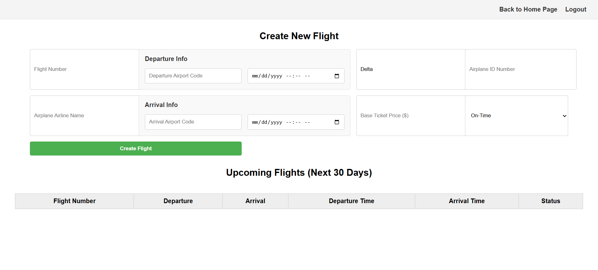  
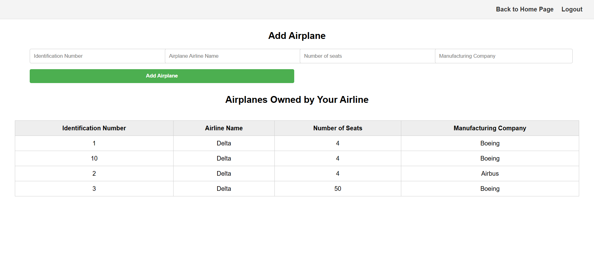  
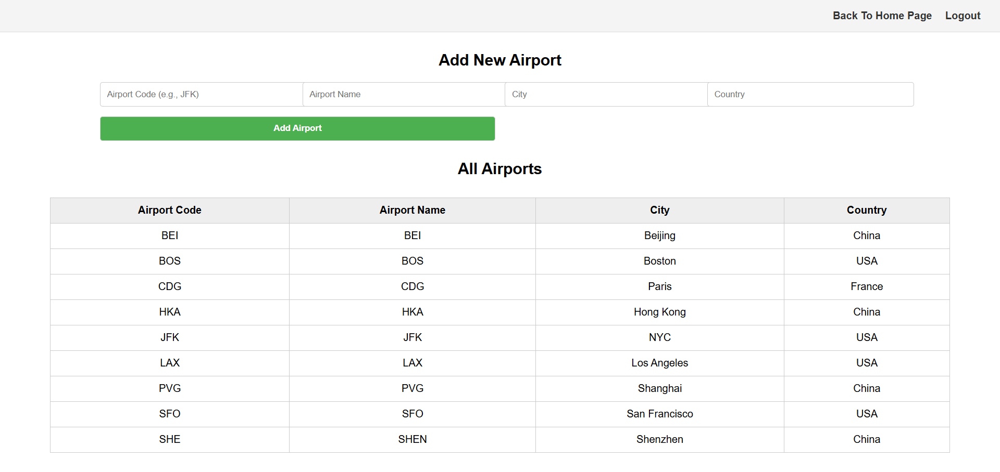  
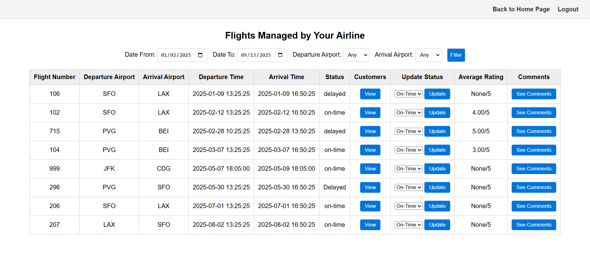  
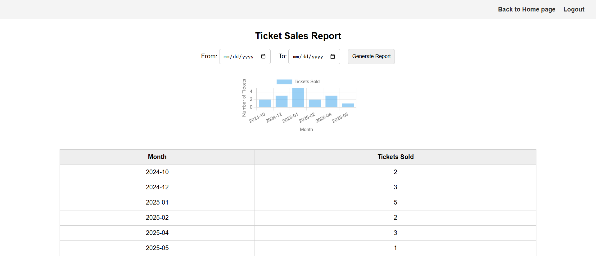  

---
## 📜 License
This project was developed as an academic coursework assignment.  
For demonstration purposes only – **not for production use**.

---

## 🙌 Credits
Developed by **Helin Mazi** and **Gaelle Mechleb** for the **Intro to Databases (CS-UY 3083)** course at NYU Tandon.
